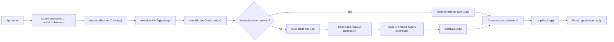

# React Native Asleep Integration Guide

[English](./INTEGRATION.md) | [한국어](./INTEGRATION.ko.md)

This guide covers production integration of `react-native-asleep` in React Native and Expo apps. It expands on the [README](../README.md) with restoration, lifecycle ownership, platform differences, recovery, analysis, reports, and release verification.

The examples use service-based sleep tracking through `initAsleepConfig()`. ODA (On-Device Analysis) is outside this guide: `setup()` configures a new ODA session and cannot run while a restored session is tracking.

## Integration flow



Three rules prevent most integration failures:

1. Complete the Android service-restoration check before configuration, and always configure afterward—even when it finds a live session.
2. Request runtime permissions only from a user action. `startTracking()` checks permissions but does not request them.
3. Treat the SDK state as native facts. Keep product workflow, persistence, timers, retries, UI, and analytics in the app.

## 1. Installation and native configuration

Follow the [README installation instructions](../README.md#installation) and [native configuration](../README.md#native-configuration).

Because the package contains native modules:

- rebuild the development or store binary after installation or a version change;
- do not validate it with Expo Go;
- do not expect an OTA update alone to install a new native SDK.

The app must provide iOS microphone usage text and the audio background mode. Android permissions and the foreground service come from the library manifest.

## 2. Own the listener lifecycle

### React applications

Mount `useAsleep()` in the integration owner that coordinates app-wide sleep tracking. The hook attaches native listeners on mount and releases them on unmount.

The listener bridge is ref-counted, so additional components may also use the hook without creating competing SDK stores. Keeping one app-level integration hook is still useful because it gives product workflow a single owner.

Importing `react-native-asleep` is side-effect-free; it does not attach listeners.

### Non-React code

Call `Asleep.initialize()` before relying on state or native events where no mounted hook owns the bridge. Always call the returned cleanup function.

```ts
import { Asleep } from "react-native-asleep";

const releaseListeners = Asleep.initialize();

const unsubscribe = Asleep.subscribe((state) => {
  console.log(state.status);
});

const removeAnalysisListener = Asleep.addEventListener(
  "onAnalysisResult",
  (result) => {
    console.log(result);
  },
);

// When the owner is disposed:
removeAnalysisListener();
unsubscribe();
releaseListeners();
```

`Asleep.initialize()` is also ref-counted, so it can coexist with mounted `useAsleep()` hooks.

## 3. Restore, then configure

Run this sequence once from the app-level integration owner:

```tsx
import { useCallback } from "react";
import { useAsleep } from "react-native-asleep";

export function useSleepTrackingBootstrap(stableUserId?: string) {
  const asleep = useAsleep();

  const initialize = useCallback(async () => {
    const restoration = await asleep.checkAndRestoreTracking();

    await asleep.initAsleepConfig({
      apiKey: "YOUR_API_KEY",
      userId: stableUserId,
    });

    const battery = await asleep.checkBatteryOptimization();

    return {
      hasActiveSession: restoration.hasActiveSession,
      battery,
    };
  }, [
    asleep.checkAndRestoreTracking,
    asleep.initAsleepConfig,
    asleep.checkBatteryOptimization,
    stableUserId,
  ]);

  return { ...asleep, initialize };
}
```

### Why this order is required

- `checkAndRestoreTracking()` asks Android native code whether tracking survived the JavaScript process and reconnects the service when needed. On iOS, the method is a required cross-platform prerequisite but returns `{ hasActiveSession: false }`; iOS has no persistent service to reconnect.
- `initAsleepConfig()` remains required after that check. A restored session does not mean the current JavaScript process has configured the SDK and report APIs.
- `checkBatteryOptimization()` marks the required prerequisite as checked. On iOS it resolves with `{ exempted: true, platform: "ios" }`.
- `startTracking()` rejects with `MISSING_PREREQUISITE` if restoration or the battery check has not run.

Do not run restoration and configuration concurrently. Do not skip configuration when `hasActiveSession` is `true`.

If initialization fails, keep tracking controls disabled and offer an app-owned retry action. Do not convert the failure into an apparently ready state.

Do not commit the API key to source control. Load it through the secret or configuration mechanism used by the app's build environment.

### Stable user identity

If the app supplies `userId`, persist the stable identifier in app storage and reuse it on later initialization. The SDK exposes the current native `userId`, but account mapping and guest-to-member policy belong to the app.

Do not reconfigure a live session with a different product identity. Define any identity migration policy outside the SDK.

## 4. Check prerequisites and start

Permission prompts must originate from a user-driven interaction:

```ts
async function startSleepTracking() {
  if (!(await asleep.hasRequiredPermissions())) {
    const granted = await asleep.requestRequiredPermissions();
    if (!granted) return { status: "permissionDenied" as const };
  }

  const battery = await asleep.checkBatteryOptimization();
  if (!battery.exempted) {
    await asleep.requestBatteryOptimizationExemption();
    return { status: "batterySettingsOpened" as const };
  }

  await asleep.startTracking({
    android: {
      notification: {
        title: "Sleep tracking",
        text: "Sleep analysis is running.",
      },
    },
  });

  return { status: "started" as const };
}
```

When Android opens battery settings, the result only means the settings flow was requested. Recheck `checkBatteryOptimization()` after the app returns and let the user retry. `startTracking()` performs its own Android exemption check and throws `BATTERY_NOT_EXEMPTED` if the device is still not exempted.

On Android 13 and later, `requestRequiredPermissions()` also requests notification permission for foreground-service visibility. Its boolean result reflects microphone-side permissions, matching `hasRequiredPermissions()`; notification denial alone does not prevent tracking.

The app owns permission-denied screens, settings guidance, retry buttons, and analytics. The library never renders UI.

## 5. Separate SDK state from app state

| SDK-owned native facts | App-owned product state |
|---|---|
| `status`, `isTracking`, `isTrackingPaused` | Bootstrap or screen readiness |
| `isRecoveryRequired`, `error` | Permission education and retry UI |
| `sessionId`, `userId` | Persisted identity mapping |
| `analysisResult`, `isAnalyzing` | Wall-clock tracking start time and duration |
| `didClose`, `isSetupComplete`, `isODAEnabled` | Alarm, widget, Live Activity, cloud sync |
| Native event and action transitions | Business retry policy and observability severity |

`status` is the lifecycle source:

| `status` | Meaning |
|---|---|
| `idle` | No projected live tracking session |
| `tracking` | Tracking is active |
| `paused` | The live native session is interrupted |
| `recoveryRequired` | The live iOS session needs an explicit foreground resume |

`isTracking` is derived from `status` and is `true` for `tracking`, `paused`, and `recoveryRequired`. Do not store a competing app boolean for the same fact.

The SDK does not expose wall-clock tracking duration. Store a start timestamp in the app and compute `now - startedAt`; do not count timer ticks because background suspension makes them inaccurate.

## 6. Platform behavior

| Concern | Android | iOS |
|---|---|---|
| Background operation | Foreground service with a persistent notification | Audio background mode |
| Cold restoration | `checkAndRestoreTracking()` reconnects the live service | No persistent service; the check returns `false` |
| Battery prerequisite | Exemption is required and checked again by `startTracking()` | Check resolves as exempted |
| Runtime permissions | Microphone; notification is also requested on API 33+ | Microphone |
| Interruption recovery | `resumeTracking()` is unsupported | `resumeTracking()` is available |
| `requestAnalysis()` promise | Full analysis payload | `{ status: "requested", timestamp }` acknowledgement |
| Reactive analysis | `onAnalysisResult`, normalized to camelCase | `onAnalysisResult` |

### Android foreground behavior

Pass notification text to `startTracking()` rather than configuring a separate notification API. The notification is part of the long-running recording service.

Test cold restoration by starting tracking, terminating the app process without ending the native session, reopening the app, and verifying that `checkAndRestoreTracking()` reconnects before configuration continues.

### iOS interruption recovery

A phone call, audio-session conflict, or failed background activation can interrupt recording. When `isRecoveryRequired` is `true`, call `resumeTracking()` after the app enters the foreground.

Use an app-owned in-flight guard so repeated foreground events do not issue concurrent resume calls:

```tsx
import { useEffect, useRef } from "react";
import { AppState } from "react-native";
import { useAsleep } from "react-native-asleep";

export function useAsleepForegroundRecovery() {
  const asleep = useAsleep();
  const resumeInFlight = useRef(false);

  useEffect(() => {
    const resumeIfNeeded = (appState: string) => {
      if (
        appState !== "active" ||
        !asleep.isRecoveryRequired ||
        resumeInFlight.current
      ) {
        return;
      }

      resumeInFlight.current = true;
      void asleep
        .resumeTracking()
        .catch(() => {
          // The classified failure is available reactively as asleep.error.
        })
        .finally(() => {
          resumeInFlight.current = false;
        });
    };

    resumeIfNeeded(AppState.currentState);
    const subscription = AppState.addEventListener("change", resumeIfNeeded);

    return () => subscription.remove();
  }, [asleep.isRecoveryRequired, asleep.resumeTracking]);
}
```

A resolved `resumeTracking()` promise means the resume request was accepted; it does not prove audio upload has recovered. The SDK keeps `status === "recoveryRequired"` until a later successful upload changes it back to `"tracking"`.

`resumeTracking()` is iOS-only and throws `UNSUPPORTED_PLATFORM` on Android.

## 7. Handle structured errors

All actions and queries reject with `AsleepError`. Do not use `null`, an empty array, or parsed message text as a generic error channel.

```ts
import { AsleepError } from "react-native-asleep";

try {
  await asleep.startTracking();
} catch (cause: unknown) {
  if (!(cause instanceof AsleepError)) throw cause;

  console.log({
    code: cause.code,
    category: cause.category,
    sdkCode: cause.sdkCode,
    caseName: cause.caseName,
  });
}
```

Tracking-runtime failures carry an objective recovery classification:

| `error.category` | Native state | Required integration behavior |
|---|---|---|
| `terminal` | The session is already gone and a separate close event may not follow | Clear app-owned live-session state and allow a new session |
| `recordingDead` | The recorder stopped, but the native session remains open | Call `stopTracking()` to close it, then start a new session |
| `recoveryRequired` | The iOS session remains live | Call `resumeTracking()` in the foreground and wait for a successful upload |
| `transient` | The session survived | Keep tracking and observe later state/events |
| `unknown` | Not safely classified | Record the error and do not assume tracking is healthy |

Only tracking-runtime failures are guaranteed to have `category`; precondition, setup, permission, report, and other action errors may leave it undefined. Use the stable `code` for action-specific behavior.

Do not call `stopTracking()` only because `isTracking` became `false`: terminal failures already closed their session. The demonstrated exception is `recordingDead`, where `isTracking` is false but `stopTracking()` is required because native recording stopped without closing the session.

Forward the `AsleepError` itself to observability so `cause`, `sdkCode`, and `caseName` remain available. The app decides log severity; the SDK only reports the recovery fact.

## 8. Stop tracking and read reports

`stopTracking()` closes the active session and marks the public state closed. The final `sessionId` may also arrive through the native close event. Product cleanup—alarms, app timers, cloud state, and navigation—belongs to the app and should occur only after the SDK stop succeeds or a terminal event proves the session is gone.

Report generation may lag behind session close. The wrapper produces `REPORT_NOT_FOUND` when native code resolves without a report payload, but platform SDK failures can arrive under another `AsleepError.code` such as Android `REPORT_ERROR`. Do not blanket-retry every report failure. Until all native not-found codes are normalized by the wrapper, choose retry behavior only for error cases the app has explicitly verified; keep network, authentication, and other failures visible.

Report APIs:

| Action | Result |
|---|---|
| `getReport(sessionId)` | One `AsleepReport`; may throw `REPORT_NOT_FOUND` when native resolves no payload |
| `getReportList(fromDate, toDate)` | `AsleepSession[]`; an empty array is a valid result |
| `getAverageReport(fromDate, toDate)` | `AsleepAverageReport`; may throw `REPORT_NOT_FOUND` when native resolves no payload |
| `deleteSession(sessionId)` | Deletes a session or throws |

`getReportList()` currently returns at most 100 sessions and has no public pagination API. Pass dates as `YYYY-MM-DD`.

## 9. Consume analysis consistently

`requestAnalysis()` has different promise results:

- Android resolves with the analysis payload and also emits `onAnalysisResult`.
- iOS resolves with `{ status: "requested", timestamp }`; the result arrives later through `onAnalysisResult`.

For cross-platform UI, read `analysisResult` and `isAnalyzing` from `useAsleep()` or subscribe to `onAnalysisResult`. The event transition is the only writer of reactive `analysisResult`, preventing an Android promise and event from updating state twice.

```tsx
import { useAsleep } from "react-native-asleep";

export function useLiveSleepAnalysis() {
  const { analysisResult, isAnalyzing, requestAnalysis } = useAsleep();

  async function refresh() {
    await requestAnalysis();
    // Read `analysisResult`; the promise is not the cross-platform result.
  }

  return { analysisResult, isAnalyzing, refresh };
}
```

Android snake_case event payloads are normalized to camelCase before they reach `analysisResult`.

## 10. Keep optional product features outside the SDK

These concerns are intentionally app-owned:

- account authentication and cloud synchronization;
- alarms, widgets, Live Activities, and notifications unrelated to the Android tracking service;
- report-derived labels, timeline slots, and product metrics;
- persistent storage and wall-clock duration;
- permission-denied UI and retry policy;
- analytics and observability.

Integrate them around SDK state and events. Their failure should not silently skip or replace the SDK's required start, stop, restore, or recovery operations.

## Production checklist

- [ ] Install an exact package version and create a new native build.
- [ ] Verify the API key and initialization-failure UI.
- [ ] Test a cold start with no granted permissions.
- [ ] Test microphone denial and a later successful request from a user action.
- [ ] On Android 13+, test both notification grant and denial.
- [ ] Verify the Android foreground-service notification.
- [ ] Verify battery exemption, settings return, and the second check.
- [ ] On Android, start tracking, kill the JavaScript app process, reopen it, and restore the live session.
- [ ] Verify `initAsleepConfig()` still runs after an Android session is restored.
- [ ] Keep tracking through background and foreground transitions.
- [ ] On iOS, trigger an audio interruption and verify foreground recovery through a later upload.
- [ ] Verify each handled error category against its documented action.
- [ ] Verify `recordingDead` closes the remaining native session before restart.
- [ ] Verify a terminal failure does not wait for or synthesize a second close event.
- [ ] Stop tracking and verify the app distinguishes a pending report from network, authentication, and other failures on both platforms.
- [ ] Verify analysis UI from `analysisResult` on both platforms.
- [ ] Run a full-night-length session on representative physical iOS and Android devices.

Simulator audio behavior and warm-path testing alone are not sufficient release evidence.

## References

- [SDK README](../README.md)
- [Example app](https://github.com/asleep-ai/asleep-sdk-react-native/tree/main/example)
- [Asleep developer documentation](https://docs.asleep.ai)
- [GitHub issues](https://github.com/asleep-ai/asleep-sdk-react-native/issues)
